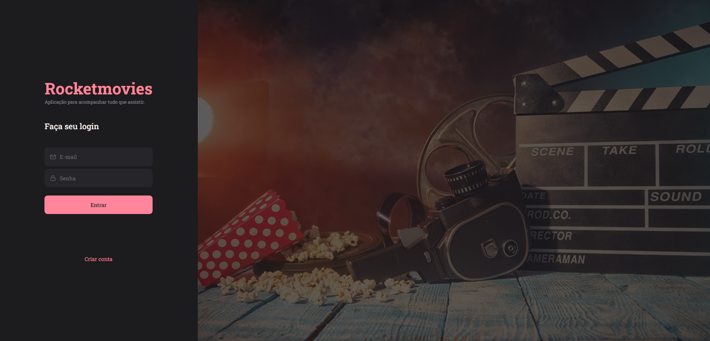

<h1 align="center"> FrontEnd - Rockemovies </h1>

## Projeto

Este projeto foi desenvolvido para aplicar habilidades em ReactJS, Javascript, HTML e CSS, para a criação do projeto do front-end para a aplicação RoocketMovies.

<p>
  
</p>

Para rodar o projeto: <br>
  ```npm install```<br>
  <br>```npm run dev```

<br>

## Tecnologias
- ReactJS
- HTML
- CSS
- JavaScript
- Styled Components


Projeto criado a partir de um desafio proposto do nível 9 do Explorer da Rocketseat.